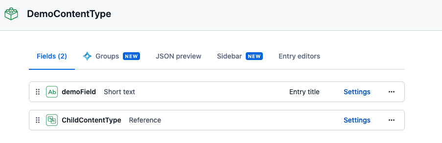
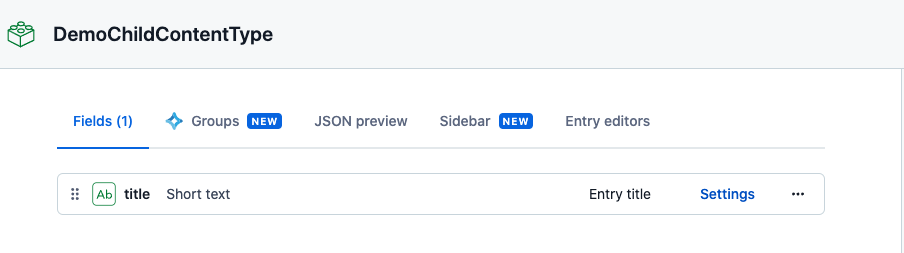
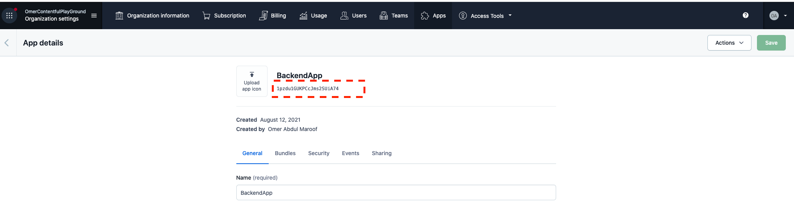
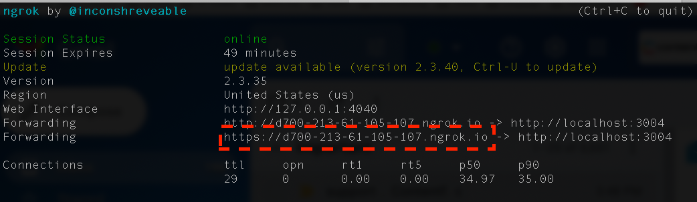
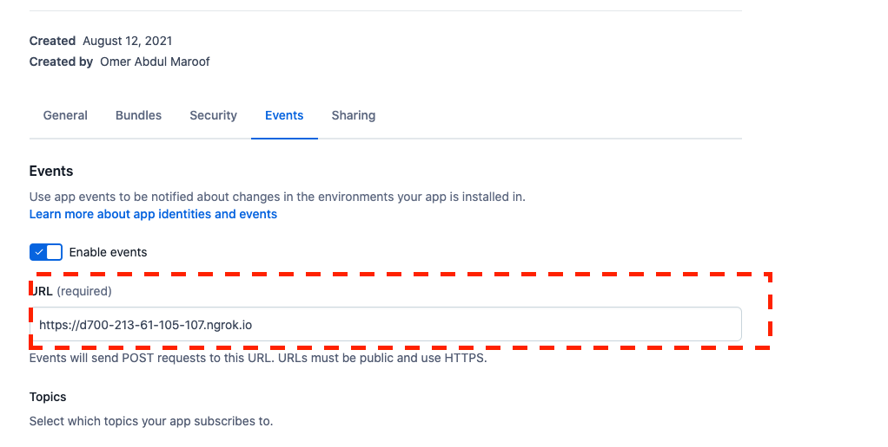

# Contentful-Sample-Backend-App

Using this backend app you can demo 3 kind of use cases.

- On entry creation, set the default value. 
- On entry creation, set the Tag to the entry. 
- On entry creation, create the child entry. 

## Steps to run the app
### 0. Install ngrok 
- https://ngrok.com/download

### 1. Setting up your Content Model
- Create a Content Type with name "DemoContentType" and following Fields
    - demoField (Short Text)
    - childContentType (Reference 1 to 1)

- Create a second Content Type with name "DemoChildContentType" and following Fields
    - title

### 2. Setting up Tags
- Go to Settings -> Tags -> Create Tag
- Create a Tag with name "digitalMarketing"

### 3. Create App Definition, Keys and Secret
- Go to Organization Settings -> Apps -> Create App
    - Provide the App Name.

- APP_ID
    - Copy the APP_ID it would be below the App Name in App Definition and update the APP_ID in index.js on line 31.

- Go to Security -> Generate Key Pair
    - Download the Key Private Key and store in "Contentful-Sample-Backend-App/keys/" as "key.pem".
    - Create Signing Secret and copy and use them in index.js by assigning to variable SIGNING_SECRET.

- Go to Events -> Enable events
  - provide "https://www.example.com" as URL (We will update this when we will run ngrok)
  - And Enable Create event on Entry. 

### 4. Configuring the App
- Make sure the key.pem we downloaded from previous step is in Contentful-Sample-Backend-App/keys/

- Also make sure the fields names are same as mentioned above as sample app uses them.

### 5. Running the App
- cd into Contentful-Sample-Backend-App and Run node index.js (App runs on port 3004)

- open another terminal and run ngrok http 3004, this will give you https URL as shown below, which can be added into the app.

- Copy the URL from previous step and go into Events tab and update the App as shown below.

- Install the App into your Space and Enviroment
